# Maleapy
###  The exercises of Andrew Ng's Machine Learning programmed with python

**You can get video resuorces from here:** https://pan.baidu.com/wap/link?surl=1o8Frmno

---

## Exercise0: Basic using of python
> #### Here you can create plots with matplotlib. And there is a practical application which predicts the GMV of Alibaba in double eleven. 

* ### How to use matplotlib

---

## Exercise1: Linear Regression
> #### Implemented linear regression and get to see it work on data in this exercise

* ### Linear regression with one variable
> Implemented linear regression with one variable to predict profits for a food truck in this part of this exercise.

* ### Linear regression with multiple variables
> Implemented linear regression with multiple variables to predict profits for a food truck In this part of this exercise. The following pictuer is a curve of cost function.

---

## Exercise2: Logistic Regression
> #### Implemented logistic regression and apply it to two different datasets in this exercise.

* ### Unregularized Logistic Regression
> This exercise will program logstic regression to build a classification model that estimates an applicant’s probability of admission based the scores from those two exams. 

* ### Regularized Logistic Regression
> This exercise will implement regularized logistic regression to predict whether microchips from a fabrication plant passes quality assurance (QA).  

---

## Exercise3: Multi-class Classification and Neural Networks
> #### Implemented one-vs-all logistic regression and used neural networks whose parameters had been calculated to recognize hand-written digits.

* ### Multi-class Classification
> This part of the exercise extended the previous implemention of logistic regression and applied it to one-vs-all classification on recognizition of handwritten digits.

* ### Neural Networks
> This part of the exercise implemented a neural network to recognize handwritten digits using the same training set as before. The neural network can be able to represent complex models that form non-linear hypotheses. 

**The accuracy rate of neural network on training set is :**

**showed predictions dynamicly (animate.py):**

---

## Exercise4: Neural Networks Learning
> #### Implemented the backpropagation algorithm for neural networks and applied it to the task of hand-written digit recognition.

* ### Regularized cost function
> Implemented and tested the regularized cost function and feedforward propagation.

**Selected 100 pictures to predict and showed results dynamicly (animate.py):**

* ### Backpropagation
> Implemented the backpropagation algorithm to compute the gradient for the neural network cost function. And then performed gradient checking to validate backpropagation.

**This the the result of gradient checking:**

**At last we get parameters and the accuracy rate with these parameters:**

---

## Exercise5: Regularized Linear Regression and Bias v.s. Variance
> #### implement regularized linear regression and use it to study models with different bias-variance properties.

* ### Regularized Linear Regression
> Implemented regularized linear regression to predict the amount of water flowing out of a dam using the change of water level in a reservoir. 

* ### Bias-variance
> An important concept in machine learning is the bias-variance tradeoff. Models with high bias are not complex enough for the data and tend to underfit, while models with high variance overfit to the training data. In this part of the exercise, I ploted training and test errors on a learning curve to diagnose bias-variance problems.

* ### Polynomial regression
> The problem with our linear model was that it was too simple for the data and resulted in underfitting (high bias). In this part of the exercise, I addressed this problem by adding more features using polynomial regression.

**Polynomial fit, λ = 1 (It did't fit well):**

**Polynomial learning curve, λ = 0 (overfitting (high-variance)):**

**Selecting λ using a cross validation set:**
(A good choice of λ=1 can provide a good fit to the data.)

---

## Exercise6: Support Vector Machines
> #### Implemented support vector machines (SVMs), and then used it to build a spam classifier.

* ### Support Vector Machines
> Implemented support vector machines (SVMs) and used it with various example 2D datasets. Experimenting with these datasets helped me gain an intuition of how SVMs work and how to use a Gaussian kernel with SVMs.  

**Different values of the C parameter with linear kernel SVMs.**
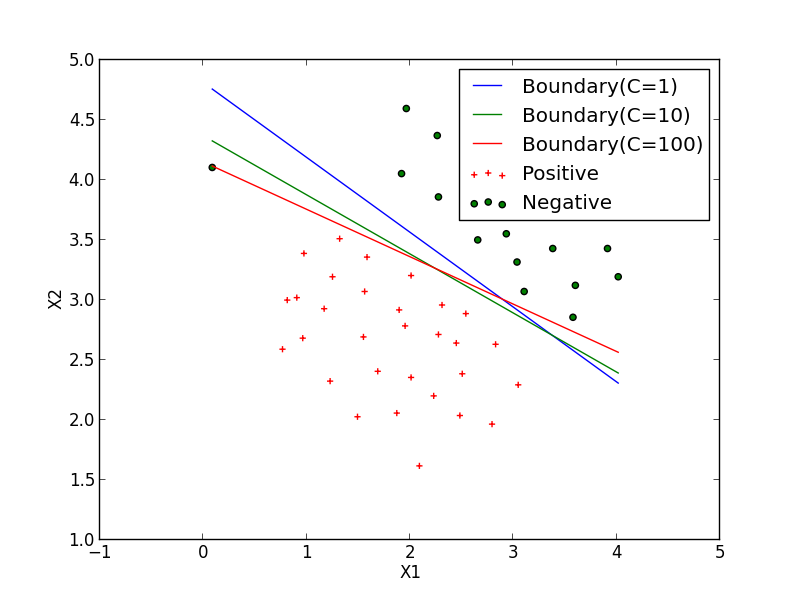

**Used Gaussian Kernel SVMs to do non-linear classification.**
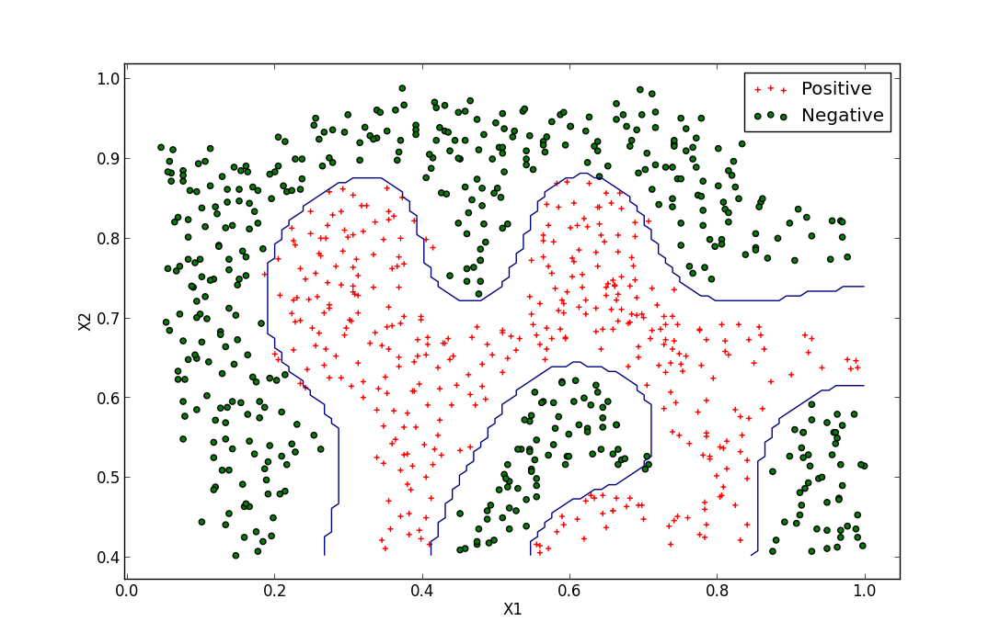

**Used the cross validation set Xval, yval to determine the best C and σ parameter to use:**

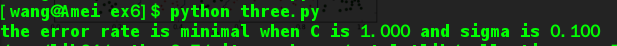
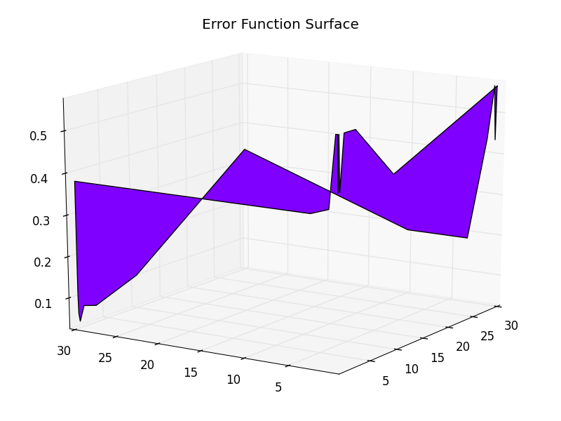

**Used the best C and σ parameter to plot the boudary**

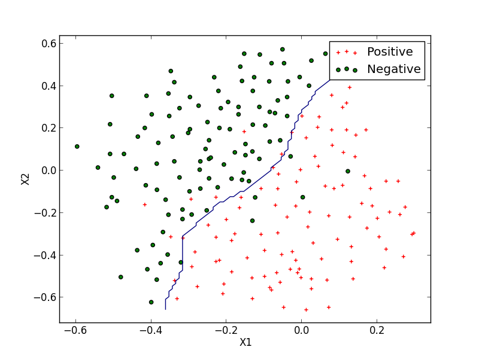

* ### Spam Classification
> Many email services today provide spam filters that are able to classify emails into spam and non-spam email with high accuracy. In this part of the exercise, I used SVMs to build my own spam filter. 

**The accuracy of model on training dataset and test dataset repsectively.**
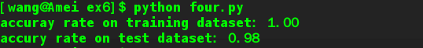

---

## Exercise7: K-means Clustering and Principal Component Analysis
> #### Implemented the K-means clustering algorithm and apply it to compress an image.And used principal component analysis to find a low-dimensional representation of face images.

* ### K-means Clustering
> Implemented the K-means algorithm and use it for image compression.

**Runned the K-means algorithm on a toy 2D dataset**
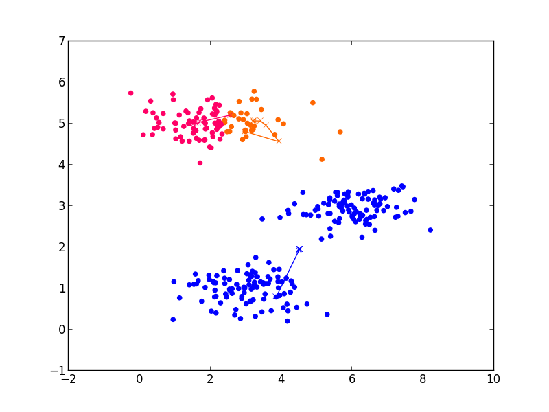

**Applied K-means to image compression**
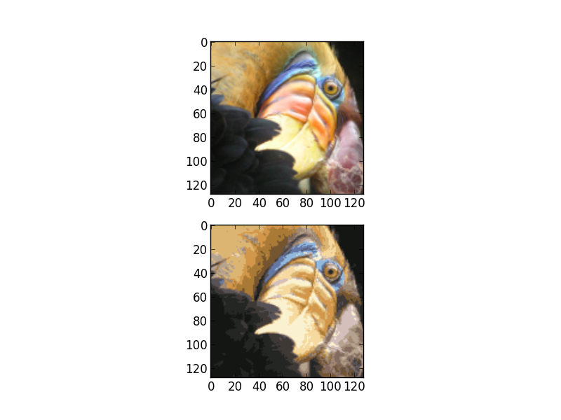

* ### Principal Component Analysis
> Implemented principal component analysis (PCA) and used it to perform dimensionality reduction. 

**Experimented with an example 2D dataset to get intuition on how PCA works:**
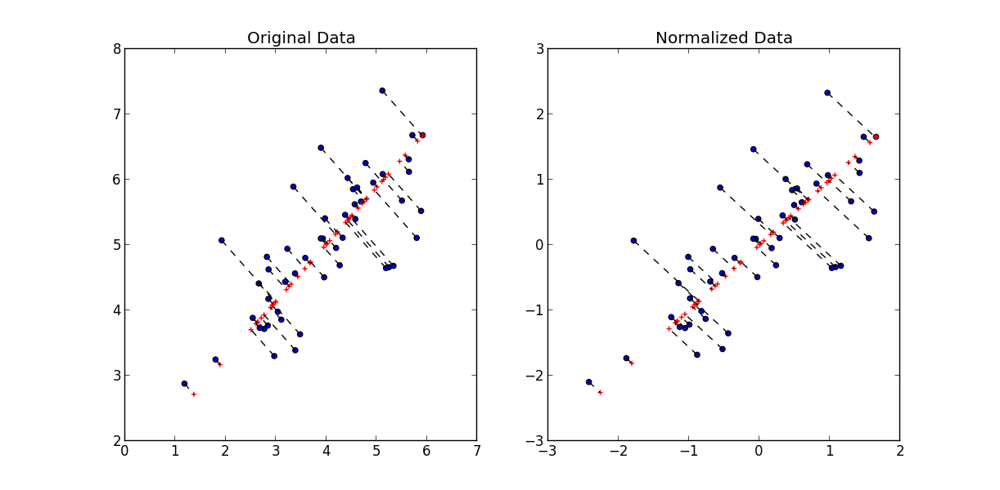

* ### Use PCA on face image dataset
> Runned PCA on face images to see how it can be used in practice for dimension reduction.

**Original face images**
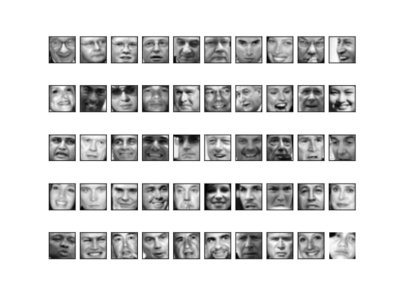

**Normalized face images**
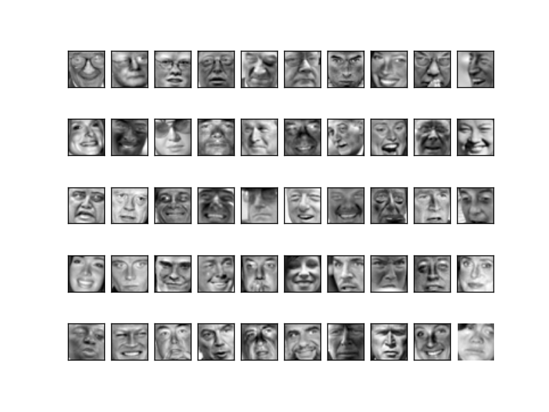

**Dimension reduced  face images**
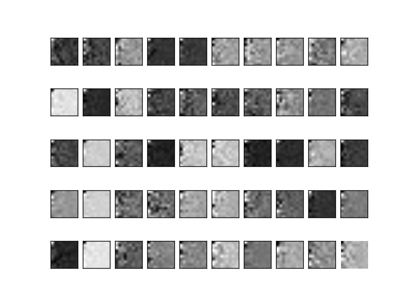

**Reconstructed face images**

___

## Exercise8: Anomaly Detection and Recommender Systems
> #### Implemented the anomaly detection algorithm and apply it to detect failing servers on a network. And then implemented collaborative filtering to build a recommender system for movies. 

* ### Anomaly detection
> Implemented an anomaly detection algorithm to detect
anomalous behavior in server computers. 

**Estimated parameters for a Gaussian and selected the threshold:**
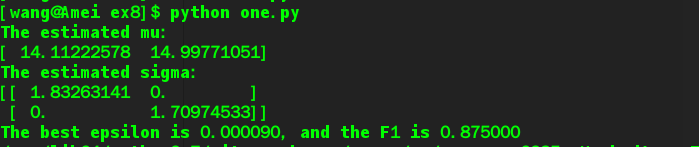

**The Gaussian distribution contours of the distribution fit to the dataset:**
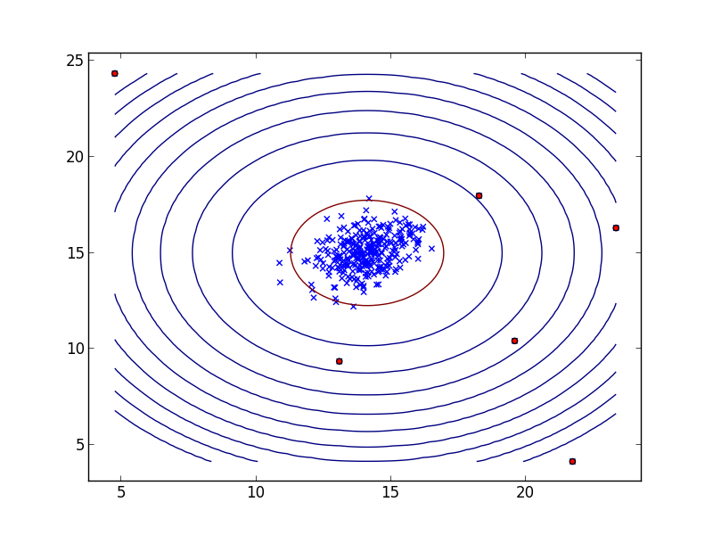

**Runned the implemented anomaly detection algorithm on a more realistic dataset:**
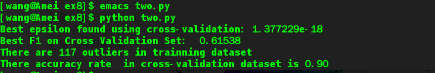

* ### Recommender Systems
> Implemented the collaborative filtering learning algorithm and applied it to a dataset of movie ratings. This dataset
consists of ratings on a scale of 1 to 5. The dataset has nu = 943 users, and nm = 1682 movies.

**Implemented cost function and gradient:**
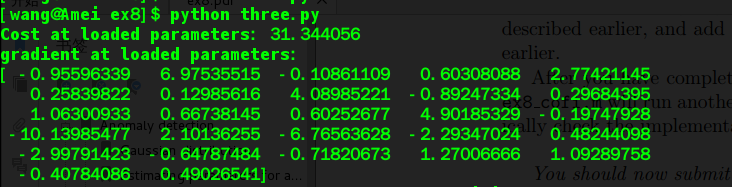
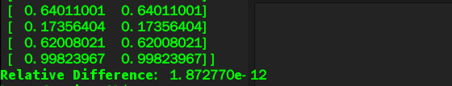

**Trained the algorithm to make movie recommendations:**
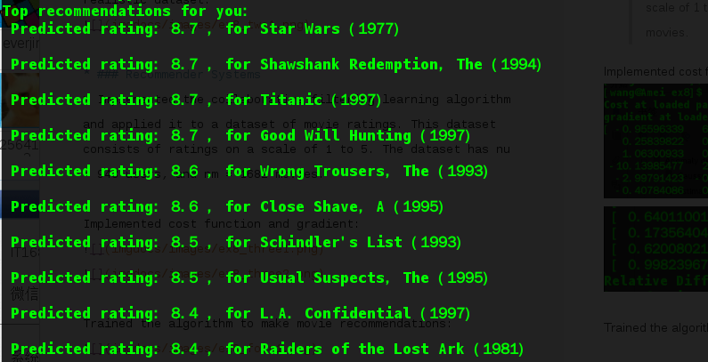
