# Maleapy
### Some simple exercises of Machine Learning with python

---

## Exercise0: Basic using of python
> #### Here you can create plots with matplotlib. And there is a practical application which predicts the GMV of Alibaba in double eleven. 

* ### How to use matplotlib
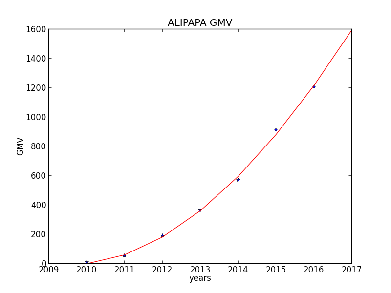

---

## Exercise1: Linear Regression
> #### Implemented linear regression and get to see it work on data in this exercise

* ### Linear regression with one variable
> Implemented linear regression with one variable to predict profits for a food truck in this part of this exercise.

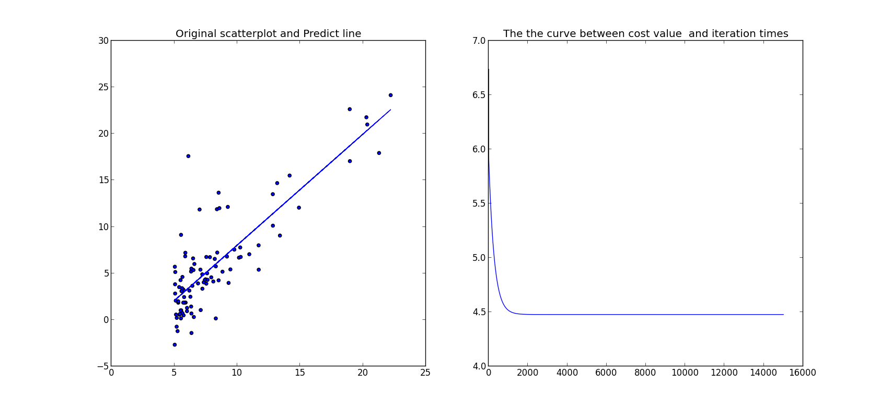
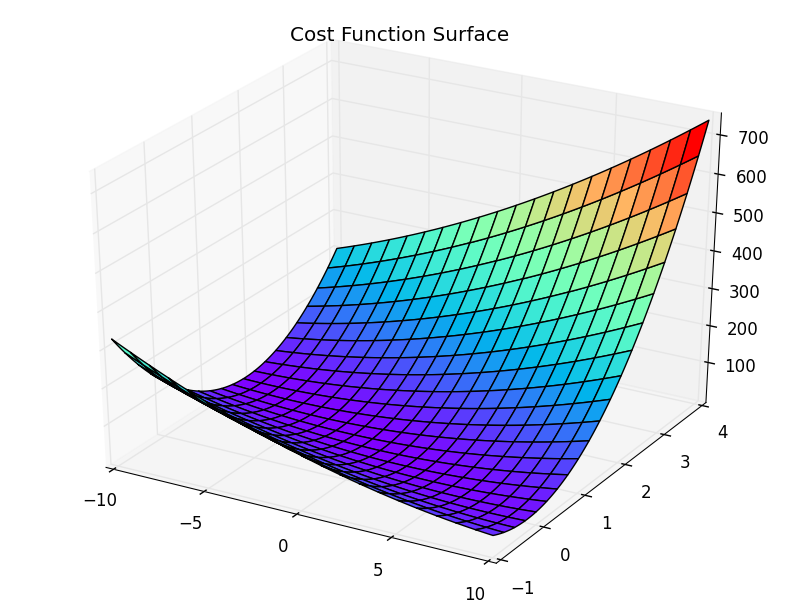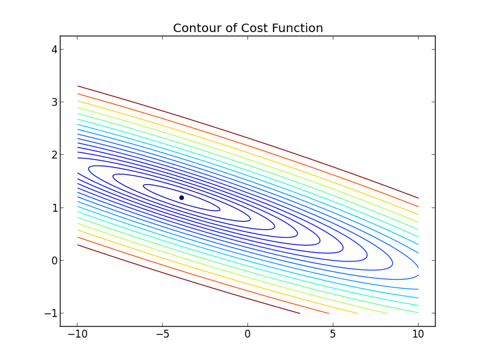

* ### Linear regression with multiple variables
> Implemented linear regression with multiple variables to predict profits for a food truck In this part of this exercise. The following pictuer is a curve of cost function.

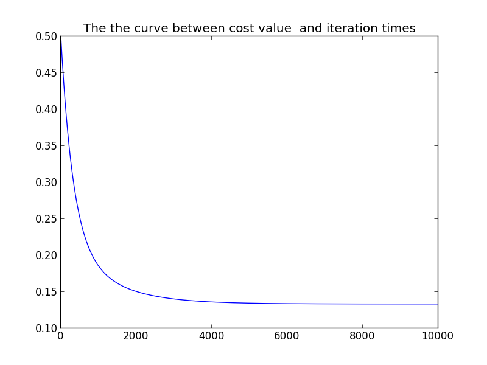

---

## Exercise2: Logistic Regression
> #### Implemented logistic regression and apply it to two different datasets in this exercise.

* ### Unregularized Logistic Regression
> This exercise will program logstic regression to build a classification model that estimates an applicant’s probability of admission based the scores from those two exams. 

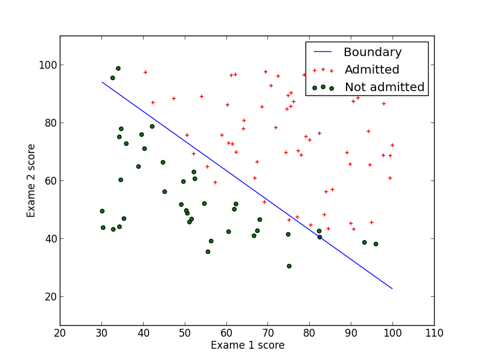

* ### Regularized Logistic Regression
> This exercise will implement regularized logistic regression to predict whether microchips from a fabrication plant passes quality assurance (QA).  

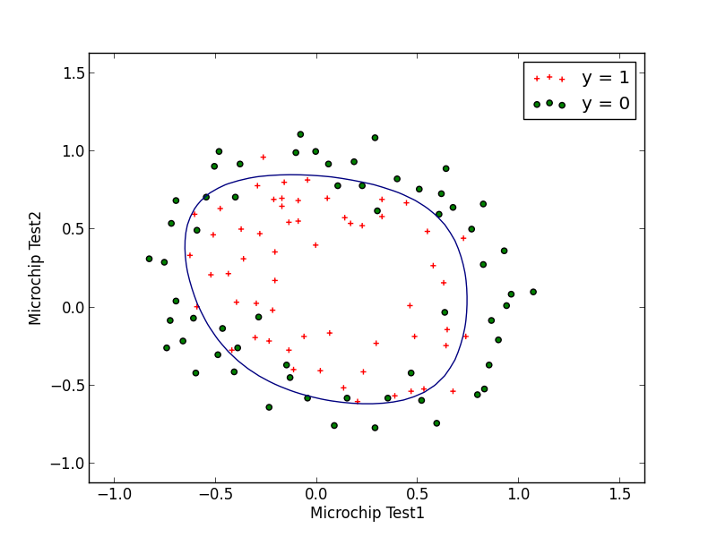

---

## Exercise3: Multi-class Classification and Neural Networks
> #### Implemented one-vs-all logistic regression and used neural networks whose parameters had been calculated to recognize hand-written digits.

* ### Multi-class Classification
> This part of the exercise extended the previous implemention of logistic regression and applied it to one-vs-all classification on recognizition of handwritten digits.

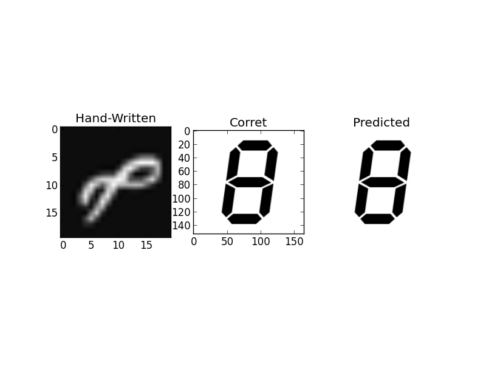

* ### Neural Networks
> This part of the exercise implemented a neural network to recognize handwritten digits using the same training set as before. The neural network can be able to represent complex models that form non-linear hypotheses. 

The accuracy rate of neural network on training set is :
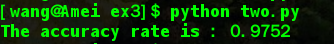

showed predictions dynamicly (animate.py):

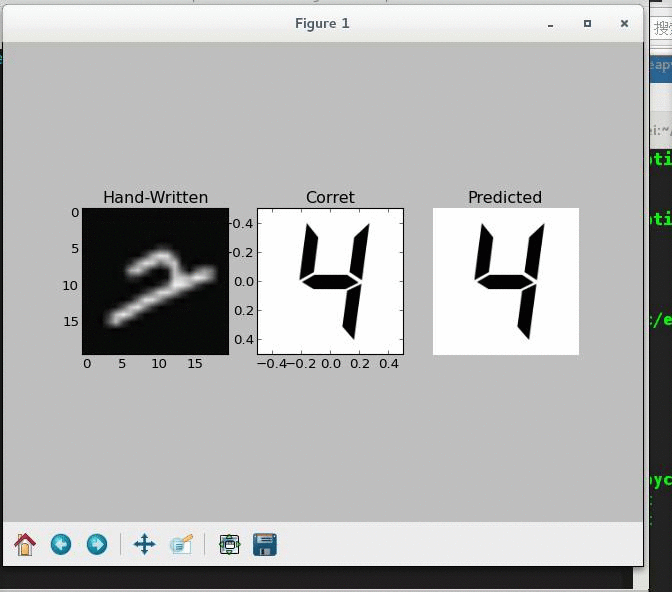

---

## Exercise4: Neural Networks Learning
> #### Implemented the backpropagation algorithm for neural networks and applied it to the task of hand-written digit recognition.

* ### Regularized cost function
> Implemented and tested the regularized cost function and feedforward propagation.

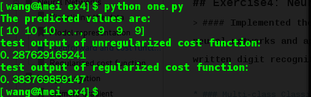

Selected 100 pictures to predict and showed results dynamicly (animate.py):

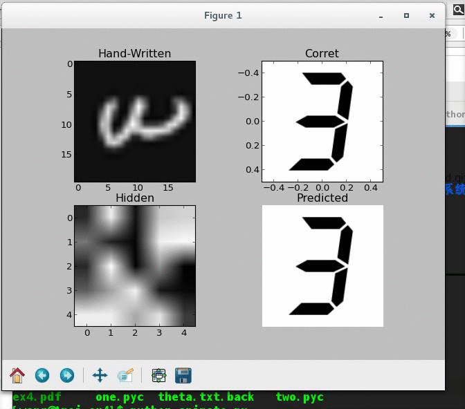

* ### Backpropagation
> Implemented the backpropagation algorithm to compute the gradient for the neural network cost function. And then performed gradient checking to validate backpropagation.

This the the result of gradient checking:

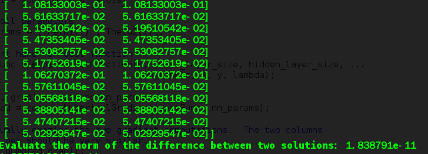

At last we get parameters and the accuracy rate with these parameters:

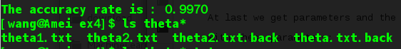

## Exercise5: Neural Networks Learning
> #### Implemented the backpropagation algorithm for neural networks and applied it to the task of hand-written digit recognition.

* ### Regularized Linear Regression
> Implemented regularized linear regression to predict the amount of water flowing out of a dam using the change of water level in a reservoir. 

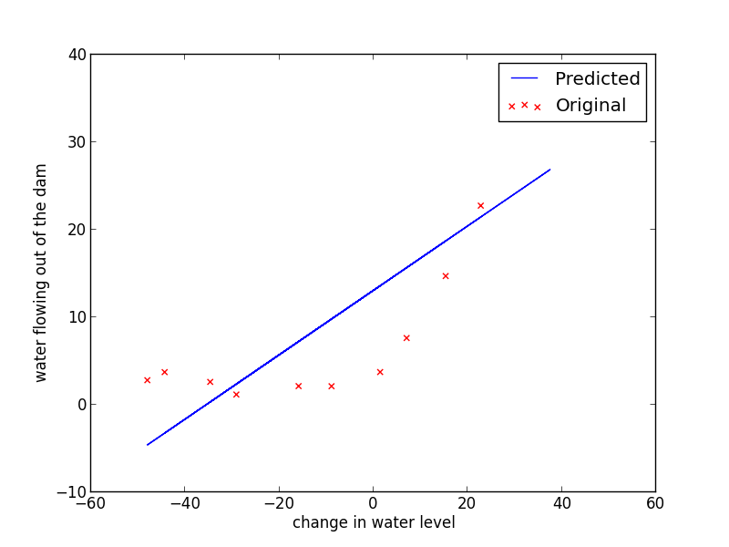

* ### Bias-variance
> An important concept in machine learning is the bias-variance tradeoff. Models with high bias are not complex enough for the data and tend to underfit, while models with high variance overfit to the training data. In this part of the exercise, I ploted training and test errors on a learning curve to diagnose bias-variance problems.

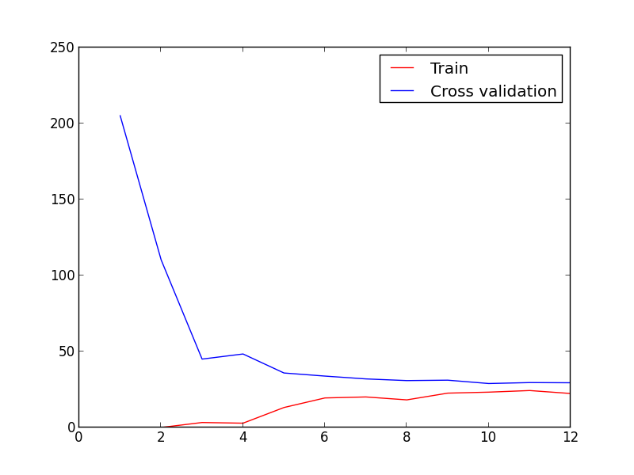

* ### Polynomial regression
> The problem with our linear model was that it was too simple for the data and resulted in underfitting (high bias). In this part of the exercise, I addressed this problem by adding more features using polynomial regression.

Polynomial fit, λ = 1:
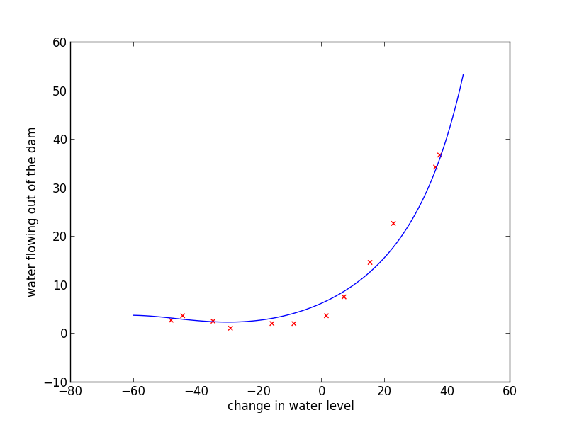

Polynomial learning curve, λ = 0:
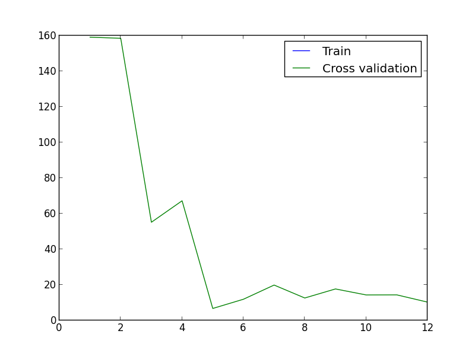

Selecting λ using a cross validation set:
(A good choice of λ=1 can provide a good fit to the data.)
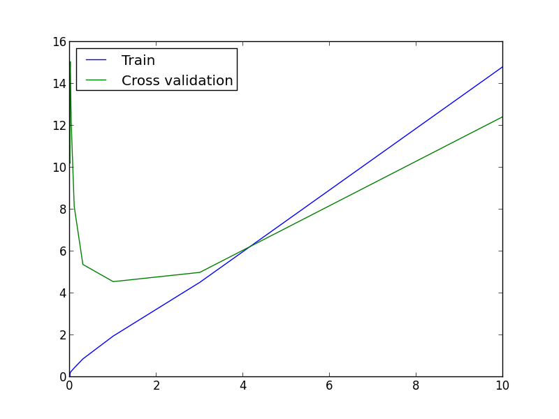